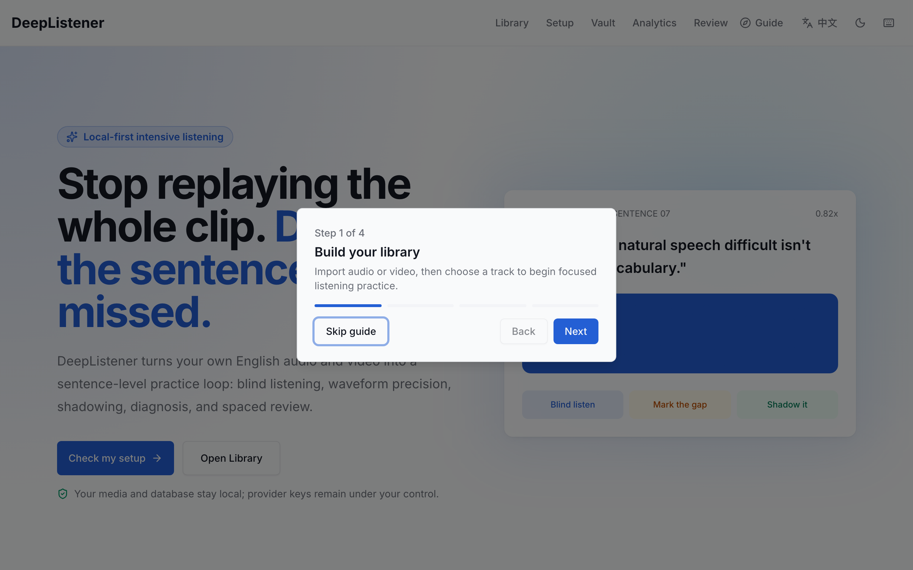
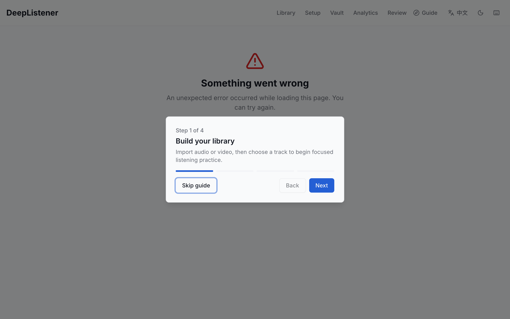
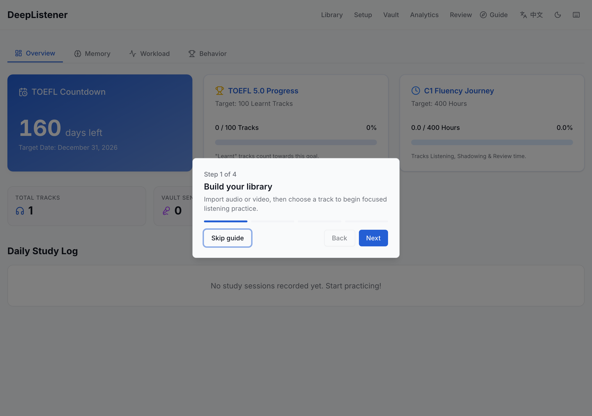
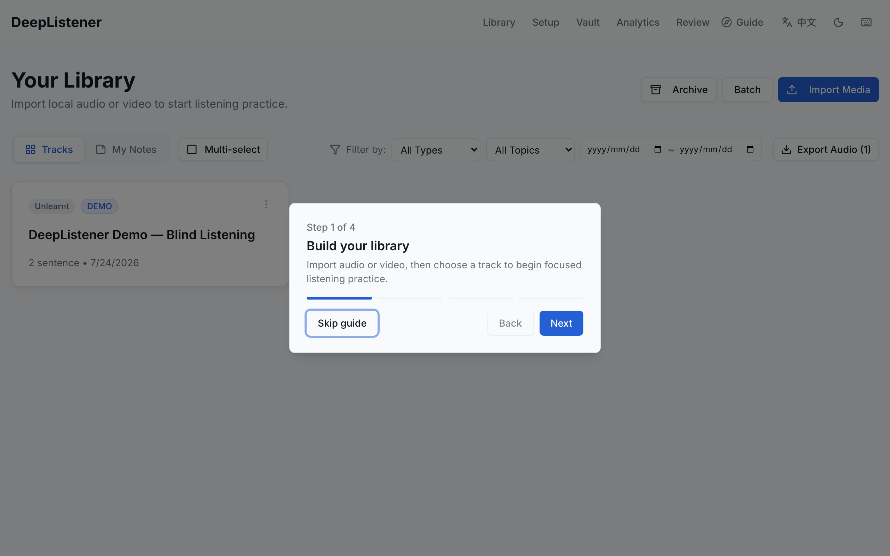
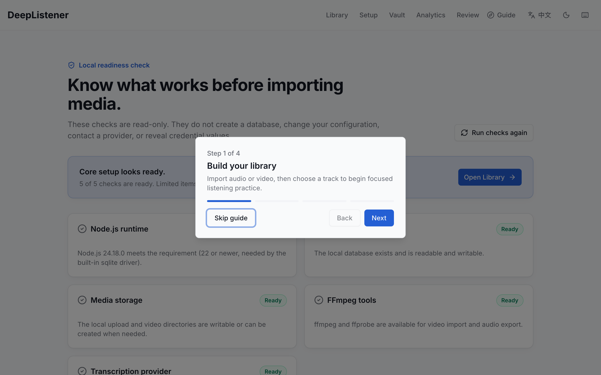
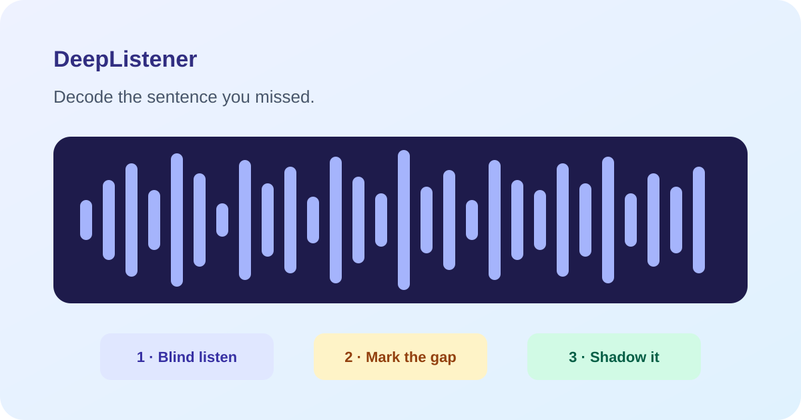

# DeepListener

**English** · **[简体中文](README.zh-CN.md)**

DeepListener is a local-first, sentence-level English listening trainer. It breaks listening material into the smallest diagnosable units, drives an intensive-practice / shadowing / spaced-review loop, and keeps all of your media, database, and provider keys on your own machine.

- **Self-hosted & local-first:** your media, your database, and your provider keys stay on your own machine.
- **Bring your own media:** DeepListener ships no copyrighted sample media; you import audio/video you have the rights to use (see [SECURITY.md](SECURITY.md#media-and-content-boundary)).
- **Multi-provider transcription:** OpenAI / Deepgram / Google, chosen via environment variable.
- License: [MIT](LICENSE).

<p align="center">
  
</p>

### Screenshots

| | | |
|:---:|:---:|:---:|
|  |  |  |
| Sentence-level practice with waveform | FSRS dashboard & analytics | Media library & import |
|  |  | |

## Two ways to run DeepListener

### 1. Desktop client (recommended, alpha)

Download the latest [release dmg](https://github.com/zhouchangju/DeepListener/releases) and drag to Applications. No Node.js, Prisma, or terminal commands required. macOS Apple Silicon only for the alpha; signed builds and Windows will follow once the alpha proves out.

The client bundles a 5-second synthetic demo clip so you can try the sentence-level listening loop immediately, without a provider key or media import. To practice on real material, open `/library` and choose **Import Media**.

All user data (SQLite database, uploaded media, exported audio) lives under the OS user-data directory — nothing is sent to a server. Transcription is still BYO key; configure it on the in-app `/setup` page.

### 2. From source (developers)

```bash
npm install
cp .env.example .env        # fill in your provider key to use transcription
npx prisma generate         # generate the Prisma client (required before build)
npx prisma migrate deploy   # initialize the SQLite schema
npm run dev                 # open http://localhost:3000
```

After startup:

1. Open `/setup` and resolve any **Action needed** checks.
2. Open `/library` and choose **Import Media**.
3. Start with a short audio file so you can reach the practice screen quickly.

> DeepListener bundles one synthetic demo (`public/demo/demo-listening.mp3`, a 5-second FFmpeg-generated sine wave — no copyright) so a first session works without any provider key. To practice on real material, open `/library` and choose **Import Media**.

You can verify the build and tests **without** any private config:

```bash
npx prisma generate         # required once after install; produces the Prisma namespace types
npm run lint
npm run build
npm run test:ci
```

> Transcription features need at least one provider key in `.env`. The app, build, and test suite otherwise run without secrets. The `prisma generate` step is required because the source uses generated Prisma namespace types (e.g. `Prisma.ReviewItemWhereInput`); CI runs it automatically.

## Key features

- **Generic audio / video intensive listening:** import local audio, MP4, and WebM. One file maps to one Track (no Course/Lesson domain concepts). Video derives an MP3 audio track; embedded subtitles are preferred when parseable, otherwise the derived audio is transcribed. In Practice the video is the single playback clock — waveform, subtitles, sentence seeking, rate, and loop all share one timeline.
- **Multi-provider transcription:** choose `openai` / `deepgram` / `google` via `TRANSCRIPTION_PROVIDER`; defaults to `deepgram` (word-level timestamps, usually needs no proxy) when unset, falls back to `openai` for unknown values. Deepgram combines word-level timestamps with local re-segmentation to handle very long sentences.
- **Waveform practice workbench:** right-drag pan, scroll zoom, drag-select to loop, 0.5x–2.0x rate; blind mode blurs the text; difficulty grading (`Normal` / `Hard` / `Very Hard`); multi-stage status flow `UNLEARNT → INTENSIVE → ANALYSIS → SHADOWING → SPEED_SHADOWING → PARAPHRASE → LEARNT`.
- **Shadowing console:** original-vs-recording dual-waveform comparison; per-sentence loop, interruptible recording, live progress; in-memory slicing for zero-latency sentence switching.
- **Library management:** archive / hard-delete, filter by `trackType` / `trackTopic`, per-Track notes, rename, multi-select sequential playback, responsive mobile layout.
- **Attribution diagnostics:** forces you to record *why* you didn't hear something (linking, vocab, speed, accent, …).
- **FSRS-4.5 spaced review (Vault):** `Again` / `Hard` are remapped to 5 / 15 minute short-interval relearn. Export all / due / single-Track / filtered sentence audio, and text notes grouped by tag / difficulty / Track / date.
- **Theming:** follows the OS light/dark preference by default; manual toggle in the top-right, choice persisted.

## Interaction guide

| Action | Effect |
| :--- | :--- |
| **Space** | Play / pause |
| **Scroll** | Zoom waveform density |
| **Right Drag** | Pan waveform left/right |
| **Left Drag** | Select a region and auto-loop (plays on release) |
| **Alt + Click** | (on the Position label) toggle timeline debug mode |

### Audio export

Audio export is available from:
- **Vault page:** export all / due / current-filter sentence audio, and text notes.
- **Review page:** export the current due review queue.
- **Track practice page:** export favorited sentences for the current audio file.

Exported MP3 format: 192 kbps, 2-second silence between sentences, filename `DeepListener_Export_YYYY-MM-DD.mp3`, grouped by source audio then sentence order. If any selected sentence or Track references missing or invalid source audio, export returns an error instead of producing an incomplete file.

Text notes export as `.txt`, grouped by tag, preserving difficulty, source Track, filter conditions, and plain-text notes.

### Video import

- In Library click **Import Media** and pick a local MP4 or WebM.
- Single-file import streams the raw request body; video limit is 1 GB. Use the single-file path for large files, not Batch.
- If the video has embedded subtitles, the system tries to build a timeline directly; otherwise it uses the configured transcription provider.
- A **Show subtitles / Hide subtitles** toggle appears below video playback; it is off by default and shows only the transcript sentence aligned with the current playback position.
- The original video is stored in `public/videos/` and the derived MP3 in `public/uploads/`.
- Deleting a video Track cleans up both the original video and the derived MP3.

## Prerequisites (when running from source)

**FFmpeg (required):** video audio extraction, embedded-subtitle detection, and audio export need `ffmpeg`/`ffprobe` on your `PATH`.

```bash
# macOS
brew install ffmpeg
# Ubuntu/Debian
sudo apt-get update && sudo apt-get install ffmpeg
# Windows: download from https://ffmpeg.org/download.html and add to PATH
```

Verify:

```bash
ffmpeg -version
```

You can also run `bin/setup`, which performs dependency install, Prisma client generation, and existing migration application. It never creates or edits `.env`; configure local `.env` manually if you need transcription or Symphony credentials.

## 🖥️ Desktop Client (alpha)

DeepListener also ships as a self-contained Electron desktop client so end users do not need to install Node.js, Prisma, or run terminal commands. The client hosts the exact same Next.js service inside a sandboxed window; all user data stays under the OS user-data directory.

- **Platform:** macOS Apple Silicon (arm64). Windows and signed/notarized builds are planned once the alpha proves out.
- **Demo:** the client bundles a synthetic 5-second demo clip so you can try the sentence-level listening loop immediately, without a provider key or media import.
- **Transcription:** still BYO key (OpenAI / Deepgram / Google). Configure it on the in-app setup page; the key is stored locally with `060` permissions and never leaves your machine.
- **FFmpeg:** resolved at launch from a vendored copy if present, otherwise from the system `PATH`. See [`vendor/ffmpeg/README.md`](vendor/ffmpeg/README.md).

### Build a distributable from source

```bash
# 1. from the repo root: build the Next.js standalone bundle
npm run desktop:package

# 2. install the desktop toolchain once
(cd desktop && npm install)

# 3. pack the macOS dmg (unsigned alpha)
npm run desktop:dist
# → artifacts land in .desktop-build/dist/
```

For an unpacked `.app` (faster iteration), use `npm run desktop:dist -- --dir`.

## Repository layout

- `/src/app`: Next.js App Router pages and APIs. The root path is the product landing page; `setup` provides read-only environment diagnostics. Main app pages: `library`, `practice/[id]`, `review`, `vault`, `dashboard`, `dashboard/symphony`.
- `/src/app/api`: route handlers for upload, export, Vault, Review, Study Time, Track, Sentence, Symphony state, and byte-range media serving.
- `/src/components/feature`: business components for intensive practice, Shadowing, review, rich-text notes, waveform player.
- `/src/components/theme`: global theme provider and the top-right day/night toggle.
- `/src/components/ui`: primitive UI components (Button, Card, Dialog, Dropdown, Progress, Skeleton, …).
- `/src/lib`: Prisma client, API schema/response helpers, upload safety policy, audio utils, FSRS, text/HTML utilities, and transcription providers.
- `/src/lib/transcription`: `openai` / `deepgram` / `google` provider implementations behind a single factory.
- `/src/symphony`: local Symphony runner / orchestrator / tracker / workspace (developer tooling, not part of the learner's main flow).
- `/public/uploads`: original audio and video-derived audio; user data, gitignored.
- `/public/videos`: original local videos; user data, gitignored.
- `/prisma`: schema, migrations, and the default SQLite database `prisma/dev.db`.
- `/desktop`: Electron shell (`main.js` / `preload.js` / `electron-builder.yml`) hosting the standalone Next.js service.
- `/vendor/ffmpeg`: optional vendored FFmpeg/ffprobe binaries; defaults to system PATH, see the README in that directory.
- `/scripts`: test runner, migration tooling, desktop packaging, icon generation, Codex quality gate, and other maintenance scripts.
- `/docs`: current-state docs, maintenance manual, historical plans, audit material, and agent harness.

## Documentation

- [Docs navigation map](./docs/README.md) — start here; separates current facts, maintenance, history, and audits.
- [Changelog](./CHANGELOG.md) — long-term iteration log, organized by commit-history phases.
- [Architecture](./docs/architecture.md) — routes, APIs, data model, upload/review flows, data-safety boundaries.
- [Product Requirements (PRD)](./docs/requirement.md) — implemented behavior and module boundaries.
- [Desktop client PRD](./docs/desktop-client-prd.md) — planned Electron distribution goals, milestones, acceptance criteria.
- [Desktop distribution OpenSpec](./openspec/changes/desktop-first-distribution/proposal.md) — proposal, design, capability specs, and a parallelizable task graph.
- [Maintenance manual](./docs/maintenance.md) — provider, database, upload, export, backup, and FAQ.
- [Review system & FSRS algorithm](./docs/review-system.md).
- [Symphony orchestrator](./docs/symphony.md).
- [Technical deep-dive: solving Node.js proxy timeout](./docs/solving-node-proxy-timeout.md).

## Support

DeepListener is a **solo-maintained, best-effort** self-hosted project with no SLA and no LTS branch; only the latest `main` and the latest tag receive fixes.

- Bugs and feature requests: open a GitHub issue with version/commit and reproduction steps.
- Security reports: see [SECURITY.md](SECURITY.md) — **do not** use public issues for security reports.
- Contributions: see [CONTRIBUTING.md](CONTRIBUTING.md).

Running from source depends on FFmpeg, SQLite, and at least one transcription provider API key; configure them in your local `.env` (see `.env.example`). The remote sync scripts (`npm run sync` / `npm run sync:safe`) read their target from the `SYNC_REMOTE` / `SYNC_REMOTE_BASE` environment variables; the repository ships no deployment host.

## License

[MIT](LICENSE) © zhouchangju. Third-party dependency and external-runtime (FFmpeg) attributions are in [NOTICE](NOTICE).
