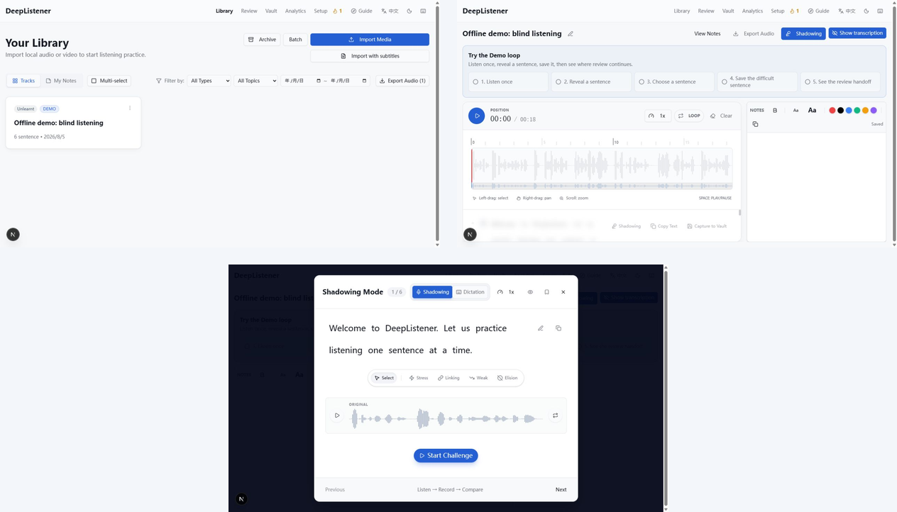

# DeepListener（中文）

**English** · **[简体中文](README.zh-CN.md)**

DeepListener 是一个专为高阶英语学习者设计的"原子级"听力解码工具，旨在通过数据驱动的精听训练，彻底突破听力瓶颈。

- **本地优先**：你的媒体、数据库和 provider key 全部留在你自己的机器上。
- **自带媒体**：DeepListener 不附带任何版权样本媒体，你导入自己有权使用的音频/视频（见 [SECURITY.md](SECURITY.md#media-and-content-boundary)）。
- **多 provider 转录**：OpenAI / Deepgram / Google，通过环境变量选择。
- 协议：[MIT](LICENSE)。

> **当前分发状态（2026-08-05）**：最近的客户端标签是 `v0.3.0-alpha.1`，它是按当前源码构建的未签名 macOS Apple Silicon 内部 alpha 版本。Windows 目前没有打包客户端；Windows 用户可以按下方步骤从源码运行 Server 版本使用。

<p align="center">
  
</p>

<p align="center"><em>真实本地 Demo 截图：在 Library 导入素材 → 在 Practice 中按句精听 → 在 Shadowing 中跟读。</em></p>

## 两种使用方式

### 1. 桌面客户端（macOS Apple Silicon，内部 alpha）

最近的 [DMG release](https://github.com/zhouchangju/DeepListener/releases) 是 `v0.3.0-alpha.1`。它是按当前源码构建的未签名 macOS Apple Silicon 内部 alpha。该打包客户端无需安装 Node.js、Prisma 或命令行工具。

首次打开会自动初始化本地数据库，并内置一段 18.4 秒、包含 6 个句子提示的 Piper 英语语音 Demo，你可以立即体验“句子级精听”闭环，不需要任何 provider key。要练习真实素材时，打开 `/library` 选择 **Import Media**。

### 2. 从源码运行（开发者和 Windows 用户）

Windows 用户目前可以通过从源码运行 Server 版本使用 DeepListener。打包桌面客户端暂时只支持 macOS Apple Silicon。使用视频导入或音频导出前，请先安装 FFmpeg/ffprobe 并将两个命令加入 `PATH`。
源码版本需要 Node.js 22+ 和 npm。

```bash
npm install
cp .env.example .env        # 填入你的 provider key 以使用转录
npx prisma generate         # 生成 Prisma client（build 前必需）
npx prisma migrate deploy   # 初始化 SQLite schema
npm run dev                 # 打开 http://localhost:3000
```

启动后：

1. 打开 `/setup` 解决任何 **Action needed** 检查项。
2. 打开 `/library` 选择 **Import Media**。
3. 先用一个短音频文件，这样能快速进入练习界面。

> DeepListener 内置一段 18.4 秒、由 Piper 生成的英语语音 Demo（`public/demo/demo-listening.mp3`），包含 6 个句子提示；不需要 provider key，也不会发起外部转录请求。要练习真实素材，请导入你自己有权使用的音频或视频。

你也可以在不配置私有 provider key 的情况下验证构建和测试：

```bash
npx prisma generate
npm run lint
npm run build
npm run test:ci
```

转录功能需要在 `.env` 中配置至少一个 provider key；应用、构建和测试本身不需要密钥。`bin/setup` 可以完成依赖安装、Prisma client 生成和已有迁移应用，但不会创建或修改 `.env`。

## 核心特性

- **通用音频/视频精听**：导入本地音频、MP4、WebM；视频会提取派生 MP3，若带可解析的内嵌字幕则优先使用，否则转录派生音轨。Practice 中视频是唯一播放时钟，波形、字幕、句子跳转、变速和循环共享同一时间轴。
- **多模型转录引擎**：通过 `TRANSCRIPTION_PROVIDER` 选择 `openai` / `deepgram` / `google`；未设置时默认 `deepgram`（单词级时间戳，通常无需代理）。Deepgram 结合单词级时间戳与本地重组分句逻辑，解决超长难句问题。
- **波形精听台**：右键平移、滚轮缩放、圈选即播、自动循环、0.5x-2.0x 变速；盲听模式一键模糊文本；状态标记与难度分级；多阶段状态流转 `UNLEARNT → INTENSIVE → ANALYSIS → SHADOWING → SPEED_SHADOWING → PARAPHRASE → LEARNT`。
- **Shadowing 工作台**：原音与录音双波形对比；单句循环、打断式录音、实时进度；基于内存切片零延迟。
- **素材管理 (Library)**：归档/物理删除、筛选与笔记、重命名、批量循环播放、移动端适配。
- **归因诊断系统**：强制记录听不懂的原因（连读、生词、语速等）。
- **智能复习 (Vault)**：基于 FSRS-4.5，对 `Again` / `Hard` 做 5 分钟 / 15 分钟短间隔重学；支持多种导出（全部/到期/单 Track/过滤，音频与文本笔记）。
- **界面主题**：默认跟随系统浅色/深色，右上角可手动切换并保留选择。

## 交互快捷键

| 操作 | 作用 |
| :--- | :--- |
| **Space** | 播放 / 暂停 |
| **Scroll** | 缩放波形密度 |
| **Right Drag** | 左右平移波形 |
| **Left Drag** | 圈选区域并自动循环（松开即播） |
| **Alt + Click** | （在 Position 标题上）开启时间轴调试模式 |

## 音频导出

- **Vault** 支持导出全部、到期、当前筛选结果的句子音频和文本笔记。
- **Review** 支持导出当前到期复习队列。
- **Practice** 支持导出当前 Track 中已收藏的句子。
- MP3 导出为 192 kbps，句子之间插入 2 秒静音，文件名为 `DeepListener_Export_YYYY-MM-DD.mp3`；如果源音频缺失或无效，导出会报错，不会生成不完整文件。
- 文本笔记导出为 `.txt`，按标签分组，并保留难度、来源 Track、筛选条件和纯文本笔记。

## 视频导入

- 在 Library 点击 **Import Media**，选择本地 MP4 或 WebM；单文件导入支持最大 1 GB 视频，大文件应使用单文件入口而不是 Batch。
- 有可解析的内嵌字幕时优先使用，否则对派生音轨调用已配置的转录 provider。
- Practice 中视频是唯一播放时钟，波形、字幕、句子跳转、变速和循环共享同一时间轴。
- **Show subtitles / Hide subtitles** 开关默认关闭，只显示当前播放位置对应的转录句子。
- 原视频保存在 `public/videos/`，派生 MP3 保存在 `public/uploads/`；删除视频 Track 时会一并清理两者。

## 前置要求（从源码运行时）

**FFmpeg（必需）**：视频音轨提取、内嵌字幕探测和音频导出需要 FFmpeg/ffprobe。

```bash
# macOS
brew install ffmpeg
# Ubuntu/Debian
sudo apt-get update && sudo apt-get install ffmpeg
# Windows：从 https://ffmpeg.org/download.html 下载并加入 PATH
```

验证安装：

```bash
ffmpeg -version
```

## 🖥️ 桌面客户端（macOS Apple Silicon alpha）

DeepListener 还提供自包含的 Electron 桌面客户端，运行相同的 Next.js 服务；所有用户数据都保存在操作系统的 user-data 目录中。

- **平台**：内部 alpha 目前只支持 macOS Apple Silicon（arm64）；Windows 暂无打包客户端，请从源码运行 Server 版本。
- **Demo**：内置 18.4 秒、包含 6 个句子提示的 Piper 英语语音，不需要 provider key。
- **转录**：支持 OpenAI / Deepgram / Google；打包的 macOS 客户端使用 Keychain，源码运行使用受限的本地文件。
- **FFmpeg**：公开包需要带校验信息的可再分发二进制；源码和明确启用的内部 alpha 可以使用 `PATH` 中的 FFmpeg/ffprobe。详见 [`vendor/ffmpeg/README.md`](vendor/ffmpeg/README.md)。

### 从源码构建可分发包

```bash
npm run desktop:package
(cd desktop && npm install)
npm run desktop:dist -- --alpha       # 内部 alpha DMG
npm run desktop:dist -- --dir --alpha # 未打包目录，便于调试
```

## 仓库结构

- `/src/app`：Next.js App Router 页面和 API；主要页面包括 `library`、`practice/[id]`、`review`、`vault`、`dashboard`。
- `/src/app/api`：上传、导出、Vault、Review、Study Time、Track、Sentence、Symphony 状态和媒体字节范围服务。
- `/src/components/feature`：精听、Shadowing、Review、富文本笔记和波形播放器等业务组件。
- `/src/lib`：Prisma、API schema/response、上传安全、音频工具、FSRS、文本工具和转录 provider。
- `/src/lib/transcription`：`openai` / `deepgram` / `google` provider 的统一实现。
- `/src/symphony`：本地 Symphony runner/orchestrator/tracker/workspace，仅供开发工具使用。
- `/public/uploads`：原始音频和视频派生音频；属于用户数据并被 Git 忽略。
- `/public/videos`：原始本地视频；属于用户数据并被 Git 忽略。
- `/prisma`：schema、migrations 和默认 SQLite 数据库 `prisma/dev.db`。
- `/desktop`：承载 standalone Next.js 服务的 Electron 壳层。
- `/vendor/ffmpeg`：可选的 FFmpeg/ffprobe 二进制和说明。
- `/scripts`：测试、迁移、桌面打包和维护脚本。
- `/docs`：当前文档、维护手册、历史计划、审计材料和 agent harness。

## 文档资源

- [文档导航地图](./docs/README.md) — 先看这里，区分当前事实、维护手册、历史计划
- [更新日志](./CHANGELOG.md)
- [当前架构](./docs/architecture.md) — routes、API、数据模型、上传/复习流、数据安全边界
- [产品需求文档](./docs/requirement.md)
- [桌面客户端 PRD](./docs/desktop-client-prd.md)
- [桌面分发 OpenSpec](./openspec/changes/desktop-first-distribution/proposal.md)
- [维护手册](./docs/maintenance.md) — Provider、数据库、上传、导出、备份
- [复习系统与 FSRS 算法说明](./docs/review-system.md)
- [Symphony orchestrator](./docs/symphony.md)
- [Node.js proxy timeout 技术深潜](./docs/solving-node-proxy-timeout.md)
- [桌面客户端使用指南](./docs/desktop-user-guide.md)
- [桌面维护手册](./docs/desktop-maintainer-runbook.md)

## Support

DeepListener 是**单人维护、尽力而为**的自托管项目，没有 SLA，也没有 LTS 分支；详见 [SUPPORT.md](SUPPORT.md)。

- Bug 与功能请求：[提交 GitHub issue](https://github.com/zhouchangju/DeepListener/issues/new/choose)，附上版本/commit 与复现步骤。
- 安全报告：见 [SECURITY.md](SECURITY.md) —— **不要**用公开 issue 报告安全问题。
- 贡献：见 [CONTRIBUTING.md](CONTRIBUTING.md)。

## License

[MIT](LICENSE) © zhouchangju。第三方依赖与外部运行时（FFmpeg）的归属见 [NOTICE](NOTICE)。
