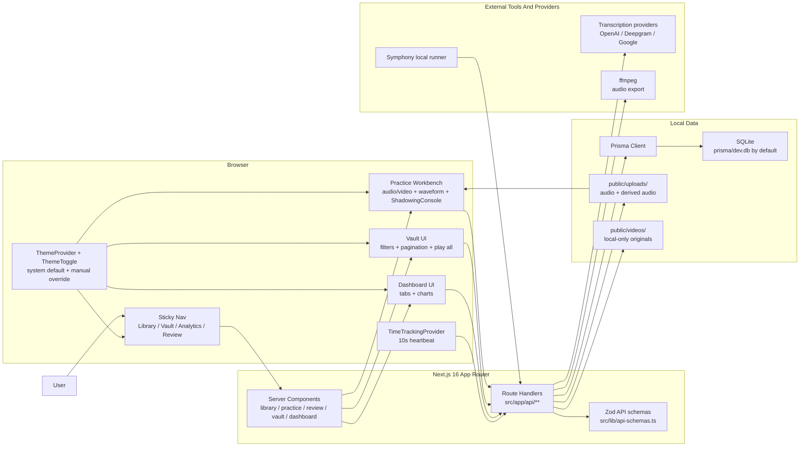
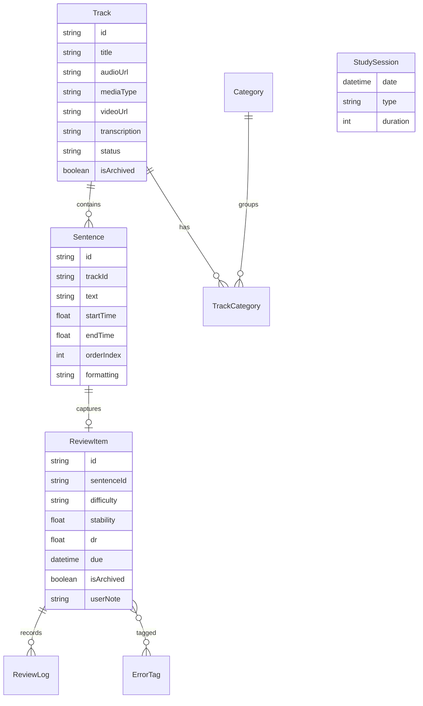
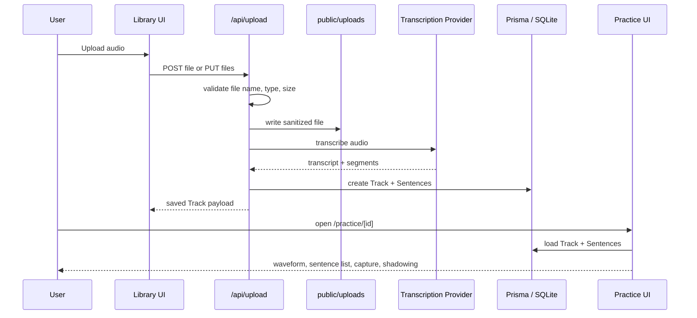
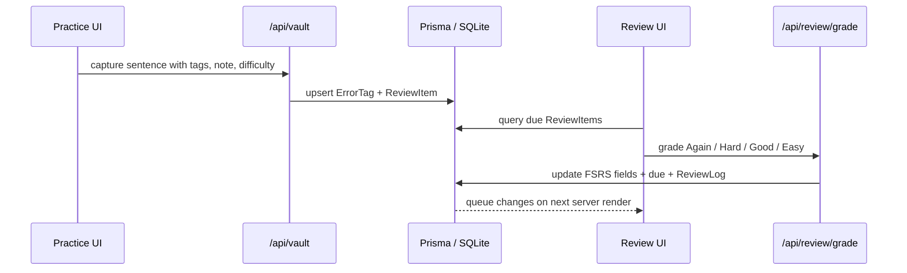

# DeepListener Current Architecture

Last updated: 2026-07-12

This document describes the current codebase implementation. For product behavior, see [requirement.md](./requirement.md). For day-to-day operations, see [maintenance.md](./maintenance.md).

## Runtime Shape

## App Routes

| Route | Current purpose | Main files |
| --- | --- | --- |
| `/` | Redirects to `/library`; there is no separate landing page. | `src/app/page.tsx` |
| `/library` | Upload, archive, filter, note, select, batch-play, and export tracks. | `src/app/library/**` |
| `/practice/[id]` | Sentence-level audio/video practice, waveform, blind mode, diagnosis capture, generic track notes, shadowing. | `src/app/practice/[id]/**`, `src/components/feature/AudioPlayer.tsx` |
| `/review` | Due-item SRS review queue with FSRS grading and short-interval relearning. | `src/app/review/**` |
| `/vault` | Captured sentence management with filters, pagination, edit modal, play all, archive, delete, text/audio export. | `src/app/vault/**` |
| `/dashboard` | Analytics tabs, progress cards, study log, retention and workload charts. | `src/app/dashboard/**` |
| `/dashboard/symphony` | Local Symphony runtime status dashboard. | `src/app/dashboard/symphony/page.tsx` |

The root layout provides the sticky navigation and wraps all pages in `ThemeProvider` and `TimeTrackingProvider`.

## Appearance And Theme System

DeepListener supports both light and dark appearance modes.

Current implementation:

- `src/components/theme/ThemeProvider.tsx` wraps `next-themes` with `attribute="class"`, `defaultTheme="system"`, and `enableSystem`.
- `src/components/theme/ThemeToggle.tsx` exposes the top-right icon button in the sticky nav. It toggles between the resolved light and dark modes after client mount to avoid hydration mismatch.
- `src/app/globals.css` defines semantic light/dark tokens for background, foreground, cards, popovers, borders, inputs, accents, primary actions, charts, and sidebar tokens.
- Legacy Tailwind utility bridges under `.dark` map existing `bg-white`, `bg-gray-*`, `text-gray-*`, border, input, prose, and Recharts surfaces into dark-compatible colors while older components are being normalized.
- The primary app routes (`/library`, `/vault`, `/dashboard`, `/review`, `/practice/[id]`) should rely on semantic tokens such as `bg-background`, `bg-card`, `text-foreground`, `text-muted-foreground`, `border-border`, and shared UI primitives wherever possible.

Theme changes are UI-only. They must not touch Prisma data, uploaded audio, transcription providers, review scheduling, or backup sync behavior.

## API Surface

| API | Methods | Notes |
| --- | --- | --- |
| `/api/upload` | `POST`, `PUT` | Single and batch local-media import. Audio is stored directly; MP4/WebM is stored under local-only `public/videos/`, with an MP3 derivative under `public/uploads/`. Embedded subtitles are preferred when usable; otherwise the audio is transcribed. |
| `/api/track/[id]` | `PATCH`, `DELETE` | Updates track metadata/status/archive fields or permanently deletes a track. |
| `/api/sentence/[id]` | `PATCH` | Updates sentence text and formatting metadata. |
| `/api/vault` | `POST` | Upserts a `ReviewItem` for a sentence and connects diagnostic tags. |
| `/api/vault/[id]` | `GET`, `PATCH`, `DELETE` | Reads note payload, updates note/tags/difficulty, or deletes a Vault item. |
| `/api/vault/[id]/archive` | `POST` | Toggles `ReviewItem.isArchived`. |
| `/api/vault/export` | `POST` | Exports text notes filtered by tags, difficulty, tracks, and date range. |
| `/api/audio/export` | `POST` | Exports captured sentence audio for all, due, track, or filtered modes. Max 500 segments. |
| `/api/library/export` | `POST` | Exports whole-track audio from selected tracks or Library filters. |
| `/api/review/grade` | `POST` | Runs FSRS update and writes a `ReviewLog`; Again = 5 minutes, Hard = 15 minutes. |
| `/api/review/log` | `POST` | Creates a standalone review log with duration. |
| `/api/study-time` | `POST` | Aggregates daily study duration by `LISTENING`, `SHADOWING`, or `REVIEW`. |
| `/api/symphony/state` | `GET` | Reads local Symphony state for the dashboard. |

Most JSON bodies are validated in `src/lib/api-schemas.ts`, and shared error helpers live in `src/lib/api-response.ts`.

## Data Model

Important naming distinction:

- `ReviewItem.difficulty` is the user-facing difficulty label: `NORMAL`, `HARD`, or `VERY_HARD`.
- `ReviewItem.dr` is the numeric FSRS difficulty value.

## Upload And Practice Flow

Upload safety is centralized in `src/lib/upload-policy.ts`:

- Accepted files must be non-empty audio, MP4, or WebM files.
- Audio is limited to 250 MB; video is limited to 1 GB.
- Stored paths are sanitized and constrained to their media directory: audio under `public/uploads/`, original video under `public/videos/`.
- Export routes resolve stored upload paths defensively to prevent path traversal.

For video Tracks, `<video>` is the playback master. WaveSurfer renders peaks from the derived audio buffer while binding transport controls to that same video element, avoiding a second audible player. Existing Vault, Review, Shadowing, batch playback, and export paths continue to consume `Track.audioUrl`.

Original videos deliberately live outside `public/uploads/`, so the existing sync scripts transfer derived audio and database state without copying `public/videos/`.

## Review And Vault Flow

The Review queue includes due, unarchived items. Good/Easy items reviewed today are excluded from same-day repeats. Again/Hard items can re-enter after their short interval.

## Dashboard And Study Time

`TimeTrackingProvider` tracks active study modes on the client. When the user is in `LISTENING`, `SHADOWING`, or `REVIEW`, it sends a 10-second heartbeat to `/api/study-time` only if audio is playing or there was user activity in the last 60 seconds.

`/dashboard` reads recent study sessions, tracks, tags, review logs, and active review items to build:

- countdown days from `NEXT_PUBLIC_TARGET_DATE`, defaulting to `2026-05-16`
- progress and total hours
- stability distribution
- retention trend
- review workload
- overdue backlog
- study heatmap
- mastery radar
- diagnostic tag distribution
- recent daily study log

## Deployment And Local Data Boundaries

Current `next.config.ts` does not configure `basePath` or `assetPrefix`. If a deployment later serves the app under `/DeepListener`, update `next.config.ts`, upload URL assumptions, PWA manifest paths, and these docs together.

Protected local data:

- `prisma/dev.db`: active local SQLite database when `DATABASE_URL="file:./dev.db"`.
- `public/uploads/`: uploaded audio.
- `.env*`: local secrets and provider credentials.

Do not delete, overwrite, migrate, or sync these without explicit user confirmation. Treat the backup sync npm script as high risk because it writes both uploads and the local database to a remote target.

## Verification Gates

| Change surface | Useful gates |
| --- | --- |
| Any code change | `npm run lint`, `npm run build` |
| Touched tests or source behavior | `node --import tsx --test <paths>` |
| Broad regression pass | `npm run test:ci` |
| Prisma schema change | `npx prisma migrate dev` after data-safety review |
| Docs-only change | Markdown link/path spot check, then broader gates only when docs affect commands or runtime assumptions |

For non-trivial refactors, performance work, migrations, deployment/basePath work, sync changes, Prisma/data changes, audio export/transcription changes, quality-gate hardening, or workflow changes, read [agent-harness/README.md](./agent-harness/README.md) before editing.
