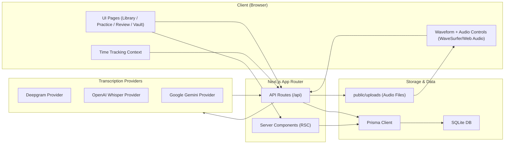
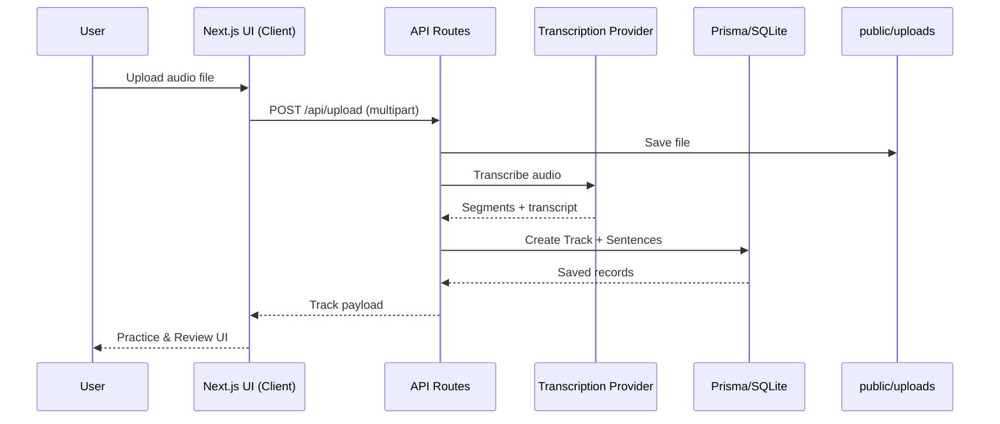

# Architecture Diagram

```mermaid
flowchart LR
  subgraph Client["Client (Browser)"]
    UI["UI Pages (Library / Practice / Review / Vault)"]
    AudioUI["Waveform + Audio Controls (WaveSurfer/Web Audio)"]
    TimeTracking["Time Tracking Context"]
  end

  subgraph NextApp["Next.js App Router"]
    RSC["Server Components (RSC)"]
    API["API Routes (/api)"]
  end

  subgraph Services["Transcription Providers"]
    Deepgram["Deepgram Provider"]
    OpenAI["OpenAI Whisper Provider"]
    Google["Google Gemini Provider"]
  end

  subgraph Storage["Storage & Data"]
    Prisma["Prisma Client"]
    SQLite["SQLite DB"]
    Files["public/uploads (Audio Files)"]
  end

  UI --> RSC
  UI --> API
  AudioUI --> API
  TimeTracking --> API

  API --> Prisma
  Prisma --> SQLite

  API --> Files
  Files --> AudioUI

  API --> Services
  Services --> API

  RSC --> Prisma
```

## Data Flow Highlights

```mermaid
sequenceDiagram
  participant U as User
  participant UI as Next.js UI (Client)
  participant API as API Routes
  participant T as Transcription Provider
  participant DB as Prisma/SQLite
  participant FS as public/uploads

  U->>UI: Upload audio file
  UI->>API: POST /api/upload (multipart)
  API->>FS: Save file
  API->>T: Transcribe audio
  T-->>API: Segments + transcript
  API->>DB: Create Track + Sentences
  DB-->>API: Saved records
  API-->>UI: Track payload
  UI-->>U: Practice & Review UI
```
