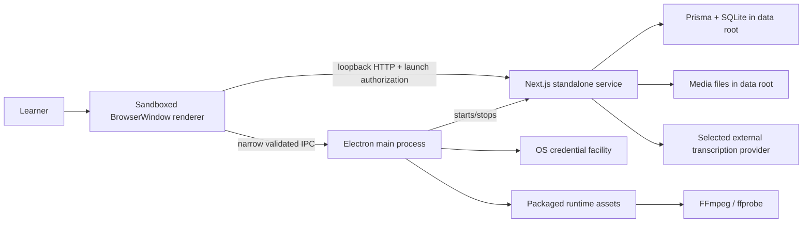

# Desktop-first Distribution Technical Design

## 1. Design Status

**Status:** W0 feasibility PASSED (2026-07-22, T050 → Proceed); W1 contract-freeze work may begin.  
**Primary decision:** Electron + Electron Forge around the existing Next.js standalone service.  
**First target:** macOS Apple Silicon feasibility.  
**Second target:** signed macOS beta, then Windows x64 using the same contracts.

### W0 outcome (recorded 2026-07-22)

All four W0 lanes passed their feasibility verdicts with executable evidence
on darwin-arm64; no design stop condition triggered. Two concrete packaging
requirements surfaced and are carried into the task graph:

1. **`.next/static` must be copied** into the standalone bundle — Next.js does
   not trace it into `.next/standalone`. Flows into T150 (productionize
   standalone build script) and the package-content audit (T011/T151).
2. **The Prisma schema-engine binary** must be bundled alongside the query
   engine for `migrate deploy` (T013 selected bundled `prisma migrate deploy`
   over a hand-rolled SQL runner; `db push` explicitly rejected). Flows into
   T180 and the audit (T011/T151).

Evidence: `docs/agent-harness/sessions/2026-07-22-desktop-feasibility/T050-feasibility-decision.md`.

## 2. Goals and Constraints

### Goals

- Remove Node.js, npm, FFmpeg, Prisma CLI, terminal, and `.env` prerequisites for Desktop users.
- Reuse current UI, API, domain behavior, tests, and SQLite model.
- Preserve the Server edition and active local data.
- Keep renderer privileges minimal and keep secrets out of browser-visible state.
- Make Windows incremental by isolating paths, binaries, credentials, installers, and OS integration.
- Make migration/update/restore copy-first and recoverable.

### Constraints

- Current media URLs assume writable `public/uploads` and `public/videos`, which is invalid inside a signed/read-only application bundle.
- Next.js App Router and Prisma require a server/Node runtime; the UI cannot be exported as a pure static Tauri frontend without substantial redesign.
- FFmpeg and Prisma include platform-specific runtime assets.
- User media may be large, private, copyrighted, or irreplaceable.
- The project is single-maintainer and cannot sustainably support every OS, architecture, store, and deployment model at once.

## 3. Architectural Decisions

### AD-001: Electron rather than Tauri for the first desktop implementation

Electron embeds the Node and Chromium runtime already assumed by the current application. Tauri would reduce shell size but still require a Node sidecar or a backend rewrite for Next.js route handlers and Prisma. The first objective is distribution validation, not runtime minimization.

Reconsider when:

- the W0 Electron/standalone spike requires broad hacks;
- a future platform-neutral backend service already exists; or
- measured installer/memory cost prevents target-user adoption.

### AD-002: Local standalone service rather than direct Node access from renderer

Electron main starts the generated Next.js standalone server in an isolated process and BrowserWindow loads its loopback origin. Existing route/page behavior remains shared with Server edition.

The renderer SHALL NOT receive Node integration. Desktop-only privileged operations use a narrow preload/IPC bridge or server-side runtime adapter.

### AD-003: One explicit data root

All mutable state resolves from `DEEPLISTENER_DATA_DIR` in the server runtime. Electron sets this from `app.getPath("userData")` before the service starts. Server edition may configure it explicitly and retains a documented legacy fallback.

Target layout:

```text
<data-root>/
├── database/
│   └── deeplistener.db
├── media/
│   ├── audio/
│   ├── video/
│   └── temp/
├── exports/
├── backups/
├── logs/
├── settings/
│   └── settings.json
└── runtime/
    └── migration-state.json
```

Secrets are not stored in `settings.json`.

### AD-004: Media identifiers and authenticated range streaming

Database records must not depend on absolute machine paths. The preferred target is a storage key/media identifier resolved by a server-side storage service.

Media route requirements:

- validate identifier and resolved root;
- prevent traversal/symlink escape;
- support `GET` and `HEAD`;
- support single byte ranges with correct `206`, `Content-Range`, `Accept-Ranges`, length, and MIME;
- return `416` for unsatisfiable ranges;
- stream from disk rather than buffer complete files;
- preserve video/waveform seeking semantics.

A compatibility adapter may translate existing `/uploads/...` and `/videos/...` values during migration, but new records should use the portable representation selected by the migration design.

### AD-005: Platform differences behind adapters

Allowed platform-specific modules:

```text
desktop/platform/*
desktop/main/*
src/lib/runtime/desktop-* (server-facing adapter only)
packaging/forge/*
```

Platform adapter responsibilities:

```ts
interface DesktopPlatformAdapter {
  dataRoot(): string;
  runtimeAsset(name: "ffmpeg" | "ffprobe"): string;
  storeSecret(provider: string, value: string): Promise<void>;
  readSecret(provider: string): Promise<string | null>;
  deleteSecret(provider: string): Promise<void>;
  selectImportFiles(): Promise<string[]>;
  selectExportPath(suggestedName: string): Promise<string | null>;
  openExternal(url: string): Promise<void>;
}
```

Domain, Prisma, review, practice, and transcription code must not branch directly on `process.platform`.

### AD-006: Copy-first migration and restore

Migration phases:

1. discover source without mutation;
2. preflight source DB/media and target disk space;
3. copy DB/media to a staging destination;
4. verify file manifest and database integrity/count invariants;
5. run schema migration against the copied database;
6. verify application health and representative records;
7. atomically mark the target active;
8. preserve the source until explicit later cleanup outside this initiative.

No desktop first run may silently reinterpret or move the active legacy database.

### AD-007: Release work is downstream of runtime proof

Signing, notarization, updater, Intel packaging, and Windows installer work do not begin before the M1 feasibility exit. This prevents expensive release plumbing around an invalid runtime architecture.

## 4. Process and Trust Boundaries



### Renderer

- `nodeIntegration: false`
- `contextIsolation: true`
- sandbox enabled
- no unrestricted `ipcRenderer` exposure
- no direct secret reads
- navigation/new-window denied unless allowlisted
- restrictive CSP

### Electron main

- owns application lifecycle, data-root selection, secret storage, native dialogs, runtime asset paths, update orchestration, and external-link allowlist;
- validates sender and payload for every IPC handler;
- never renders provider secret values back to the window;
- starts the service using Electron's supported isolated process mechanism and captures bounded logs.

### Local service

- binds `127.0.0.1`, not `0.0.0.0`;
- receives a high-entropy per-launch authorization value through process state, not persisted settings;
- rejects privileged desktop requests without the launch authorization mechanism;
- retains existing request schemas and adds explicit desktop/runtime schemas;
- never exposes raw database paths or credential values in readiness responses.

### External providers

- receive audio only when user initiates transcription and the chosen workflow requires it;
- demo and embedded-subtitle paths do not contact providers;
- connectivity checks are explicit, labeled, and safe to cancel.

## 5. Runtime Boot Sequence

1. Acquire Electron single-instance lock.
2. Resolve OS user-data directory and ensure expected directory permissions.
3. Resolve packaged Next/Prisma/FFmpeg assets and create a redacted bootstrap diagnostic record.
4. Generate a random loopback port and per-launch authorization value.
5. Preflight database state:
   - new profile → initialize from versioned migrations;
   - current schema → continue;
   - older supported schema → backup then migrate;
   - incompatible/newer/corrupt → recovery screen, no writes.
6. Start Next.js standalone service with explicit environment/config.
7. Poll `/api/health` with bounded timeout and process-liveness checks.
8. Create sandboxed BrowserWindow only after service health passes.
9. Load local origin and verify navigation origin.
10. On quit, stop accepting new work, wait for bounded graceful shutdown, then terminate remaining service process.

## 6. Next.js Standalone Packaging

Build output must include:

- `.next/standalone` minimal server;
- `.next/static`;
- immutable `public` assets only;
- Prisma generated client and platform engine assets;
- migration files/bootstrap runner;
- desktop runtime manifest;
- no user data.

The packager must verify each expected runtime file rather than relying solely on Next output tracing. Missing traced native assets must fail packaging.

Development mode may point BrowserWindow to `next dev`, but production must exercise the packaged standalone server.

## 7. Database and Migration Design

### Connection

- Build an absolute SQLite file URL from the data-root database path.
- Set it before importing/constructing the Prisma client in the service process.
- Keep one Prisma client per service process.
- Readiness requires both database read and write access.

### Migration runner

The implementation spike must decide between bundling Prisma deploy tooling and a small versioned SQLite migration runner. Selection criteria:

- uses existing migration SQL as source of truth;
- runs fully offline;
- produces deterministic version state;
- is packageable for macOS/Windows;
- supports preflight and failure injection;
- does not require development dependencies or shell commands on the user's machine.

`prisma db push` is not an acceptable production migration strategy.

### Backup integrity

A backup manifest records:

- format version;
- application version;
- schema version;
- created time;
- database checksum and integrity result;
- media entries with relative storage key, size, and checksum policy;
- required/optional file classification.

Large-media checksum policy may be tiered, but silent omission is not allowed.

## 8. Media Runtime Design

### Import

- Native dialog returns file paths only through a validated desktop bridge.
- Service streams/copies into `<data-root>/media/temp/<operation-id>`.
- Validate declared metadata and observed file type according to existing upload policy.
- Probe/extract with explicit packaged binary paths.
- Prefer valid embedded subtitles; otherwise call selected provider.
- Create database record only after required durable artifacts are ready, or compensate atomically on failure.
- Promote temp artifacts to final storage by atomic rename where the filesystem permits.

### Playback

- Browser uses same-origin media route URLs.
- Range implementation is shared by audio and video.
- MIME and content length come from validated stored metadata/probe, not untrusted request input.

### Export

- Export planning remains in shared domain/server code.
- Desktop chooses destination using native dialog or defaults to data-root exports.
- Create output in temp location, validate completion, then promote to selected destination.

### Runtime binaries

- Runtime manifest maps platform/architecture to FFmpeg/ffprobe path, checksum, source, license, and build configuration.
- Production never silently falls back to a system PATH binary.
- Development may allow an explicit opt-in system binary for contributor convenience.

## 9. Configuration and Secret Design

### Non-secret settings

Versioned settings schema includes:

- selected transcription provider;
- optional proxy/base URL policy approved for Desktop;
- update channel;
- UI preferences that are not already browser-local;
- demo state;
- diagnostic/log preferences.

Writes use temp + atomic rename and schema validation.

### Secrets

- Stored by Electron main using the selected OS-backed implementation.
- Renderer sends new secret values through a narrow one-way IPC action.
- Renderer can query only `missing/configured/invalid/unknown`, never retrieve stored values.
- Local service receives only the active provider credential for the operation/process scope selected by implementation.
- Logs redact known secret fields and authorization tokens.

## 10. First-session Design

The first session must offer two paths:

### Demo path

- bundled owned/generated/clearly licensed short media;
- bundled sentence timing/transcript;
- no provider request;
- guided highlights for blind listen, sentence navigation, save/diagnosis, and next review step;
- demo removal isolated from user library.

### Personal media path

- Settings provider selection and credential entry;
- explicit connectivity check optional;
- small-media recommendation for first import;
- actionable stage/error reporting.

The setup dashboard remains available after onboarding as Diagnostics, but it must not become a permanent top-level distraction if user testing favors a Settings location.

## 11. Release and Update Design

### Build matrix

| Stage | macOS arm64 | macOS x64/universal | Windows x64 |
|---|---|---|---|
| W0/M1 | required | not required | package smoke as early warning when practical |
| M2 | required signed/notarized | explicit support decision | package smoke |
| M3 | required regression | per M2 decision | required signed/installer beta |
| M4 | supported release | documented | supported release |

### CI layers

1. Shared lint/tests/build on Linux or existing CI.
2. Desktop unit/contract tests independent of OS.
3. Native package assembly on each target OS.
4. Package-content audit for server/static/Prisma/FFmpeg/migrations/manifests.
5. Installer launch smoke on clean runner/VM.
6. Signing/notarization verification.
7. Publish only after all required gates and manual approval.

### Update safety

- Fetch metadata over HTTPS from an approved release source.
- Verify channel/version/platform/architecture/signature/checksum.
- Refuse downgrade across incompatible schema unless explicit recovery flow exists.
- Run data health and backup before installing a schema-changing version.
- Preserve previous installer/app version until new-version health passes where platform tooling permits.

## 12. Verification Strategy

### Unit and contract

- data-root resolution and containment;
- storage-key validation;
- byte-range parsing and responses;
- settings schema and secret-state redaction;
- runtime manifest selection;
- provider error mapping;
- migration state machine and backup manifest;
- platform adapter contract.

### Integration

- Next standalone starts with disposable data root;
- Prisma engine reads/writes packaged SQLite;
- packaged FFmpeg probes/extracts/exports fixtures;
- service authorization rejects unauthenticated privileged requests;
- media import compensates on provider/FFmpeg/database failures;
- backup and restore preserve representative data/media.

### Desktop E2E

- first launch/new profile;
- demo completion;
- provider configuration state;
- import → practice → Vault → restart;
- update/migration success;
- migration failure and recovery;
- diagnostic export redaction;
- Windows path/Unicode/file-lock cases.

### Manual usability

- five observed target learners;
- no terminal assistance;
- record time and intervention for install, demo, provider setup, import, and error recovery;
- convert repeated failures into product requirements before promotion.

## 13. Parallelization and Ownership Rules

- Parallel tasks must own non-overlapping files/surfaces.
- Prisma schema/migrations, storage representation, Electron bootstrap, and Forge config each have one owner at a time.
- Specs/tests for a shared contract may be prepared in parallel with implementation only when the contract is already frozen.
- macOS signing and Windows installer can proceed in parallel only after shared package contents and update metadata are stable.
- Documentation/QA lanes may run alongside code lanes but may not claim completion before executable evidence exists.
- Each wave has an integration owner responsible for merging outputs and running the combined gate.

## 14. Failure Pre-mortem and Stop Conditions

### Stop and review architecture when

- Next standalone requires enabling Node privileges in renderer;
- Prisma cannot be packaged without shipping an uncontrolled development tree;
- media serving requires loading large files into memory;
- migration cannot prove copy-first rollback;
- FFmpeg provenance/license remains unresolved;
- platform conditionals spread into shared domain/UI code;
- Windows smoke build reveals a required business-layer fork;
- packaging maintenance blocks core Server verification repeatedly.

### Cheapest evidence that changes the decision

- A W0 disposable package demonstrating the complete local service, Prisma, FFmpeg, and fixture media path supports continuing Electron.
- Failure of that spike, or user evidence that Docker is acceptable to the intended audience, supports narrowing/stopping Desktop before costly release work.

## 15. Rejected Alternatives

### Tauri 2 now

Rejected for first implementation because the current backend remains Node/Next/Prisma. A Node sidecar preserves most packaging complexity while adding Rust/tooling and platform integration. Revisit after a platform-neutral backend boundary exists.

### Docker as the primary learner distribution

Retained for future Server convenience but rejected as the primary learner experience because Docker installation, volumes, ports, and provider configuration remain technical concepts.

### Pure PWA/static export

Rejected because current server routes, Prisma, local media processing, FFmpeg, and secure local credentials require capabilities beyond a static browser application.

### Native Swift/Windows rewrite

Rejected because it duplicates the learning UI/domain logic and exceeds single-maintainer capacity.

### Cloud-hosted service

Rejected for this initiative because it changes privacy, copyright/media handling, authentication, cost, and operational responsibility rather than merely improving distribution.
