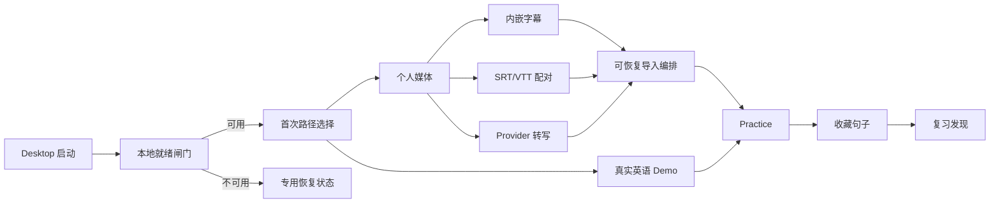
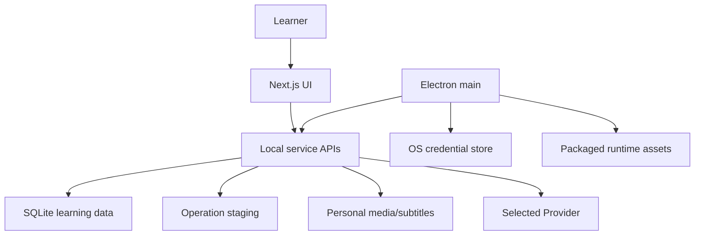

# 普通学习者首次成功体验实施方案

**状态：** 目标实施方案；不得仅凭代码存在视为全部验收通过，当前事实见 [implementation-status.md](./implementation-status.md)
**Harness 模式：** UI/文案子任务使用 Contract；数据库、导入暂存、媒体、迁移、Desktop 发布使用 Adversarial
**实施策略：** 先对账、后冻结合同；先打通免密钥价值路径，再改个人媒体恢复；最后才进入平台推广

## 1. 设计结论

本变更不新建第二套学习产品，也不重写 Desktop 底座。实施应在现有 Next.js UI、Electron 外壳、运行时路径、迁移运行器、密钥存储、Demo seed 和媒体处理能力上增加一层“首次成功编排”。

核心结构如下：



## 2. 先做现状对账

现有 `desktop-first-distribution/tasks.md` 不能直接作为执行真相。代码已经包含但任务表仍可能标为未完成的能力包括：

- `src/lib/runtime-paths.ts` 数据根解析；
- `src/lib/migration-runner.ts` 与 `src/instrumentation.ts` Desktop 自动初始化；
- `src/lib/secrets-store.ts` 和应用内 Provider 配置；
- `src/lib/demo-seed.ts` Demo 隔离、幂等 seed/removal；
- `desktop/main.js` 本地服务、路径和部分 FFmpeg/Prisma 启动逻辑。

W0 的第一个任务必须逐条标记：`implemented`、`partially implemented`、`spec only`、`blocked by release asset/platform`。没有对账证据，不允许开始重复开发。

## 3. 运行状态模型

### 3.1 首次启动状态

```tex
BOOTING
  -> READY_NEW_PROFILE
  -> READY_RETURNING_USER
  -> RECOVERY_DATABASE
  -> RECOVERY_RUNTIME_ASSET
  -> RECOVERY_DATA_ROOT
```

- 状态由服务端/桌面主进程的只读或受控启动结果产生，不存储到浏览器 localStorage 作为事实来源。
- `READY_NEW_PROFILE` 只表示本地运行时可用，不等于 Provider 已连接。
- 恢复状态必须阻断数据依赖页面，但不得阻断只读帮助、诊断导出和安全退出。
- Server edition 可展示技术细节；Desktop 默认展示用户语言，并提供可展开诊断代码。

### 3.2 首次旅程状态

```tex
NOT_STARTED
  -> PATH_SELECTED_DEMO | PATH_SELECTED_PERSONAL_MEDIA
  -> IN_PROGRESS
  -> FIRST_LEARNING_ACTION_COMPLETE
  -> REVIEW_CONTINUATION_DISCOVERED
  -> COMPLETED
```

建议将旅程状态保持为本地偏好/演示呈现状态，不写入学习数据库。真正的收藏、复习和 Track 仍以现有数据库记录为准。引导状态丢失只会导致引导重播，不能破坏学习数据。

### 3.3 导入操作状态

```tex
CREATED
  -> RECEIVING
  -> STAGED
  -> PROBING
  -> SUBTITLE_READY | TRANSCRIBING
  -> TIMELINE_READY
  -> ACTIVATING
  -> COMPLETE

任何处理中状态 -> FAILED_RETRYABLE | FAILED_TERMINAL | CANCELED
```

关键不变量：

- `COMPLETE` 前不得向用户呈现可练习的最终 Track。
- `ACTIVATING` 必须幂等；同一 operation ID 最多激活一个 Track。
- `FAILED_RETRYABLE` 保留已完成阶段和用户媒体，不重复接收文件。
- `CANCELED` 只删除该 operation 明确拥有的暂存工件。
- 学习阶段字段（如 `UNLEARNT`）不得复用为导入任务状态。

## 4. 启动门控设计

### 4.1 Desktop

复用 `src/instrumentation.ts` 的自动初始化和 `desktop/main.js` 的服务启动。新增或冻结一个最小健康合同，区分：

- service process alive；
- data root 可创建/可写；
- database compatible/readable/writable；
- required packaged assets available；
- optional media capabilities available；
- recovery code（不含私有路径和密钥）。

Electron 只在健康合同允许时打开正常窗口；否则打开 Desktop-owned recovery surface。不得让 Next.js 在数据库不兼容时继续渲染通用业务错误。

### 4.2 Server edition

Server 不自动迁移现有 `prisma/dev.db`。在依赖数据库的 layout/page 入口增加 readiness guard 或错误分类，把已知数据库未初始化错误映射到 `/setup` 的对应检查和维护说明。

通用 `src/app/error.tsx` 仍负责未知错误；它不应猜测数据库、Provider 或 FFmpeg 原因。

### 4.3 被拒绝方案

- **仅改通用错误文案：** 无法阻止每个页面重复失败，也无法给出可靠修复动作。
- **Desktop 启动失败后仍打开网页：** 会把底座错误伪装成页面问题，降低信任。
- **Server 自动迁移活跃数据库：** 违反零数据损失边界。

## 5. 可执行新手旅程设计

### 5.1 组件边界

- `OnboardingGuide` 只负责可访问的步骤呈现和焦点管理。
- 新的 journey descriptor 定义每步 `target`、`primaryAction`、`completionSignal`、`fallbackHref`。
- AppShell/页面负责真实动作；引导不得通过脆弱 DOM 查询推断业务完成。
- Demo 内步骤由 Practice 显式上报事件，例如 `played`, `revealed`, `saved`, `reviewHandoffSeen`。

### 5.2 遮罩与焦点

- 若目标需要点击，目标必须处于交互层之上或遮罩只覆盖目标外区域；不得用高于导航的全屏 click-catcher 拦截目标。
- 对话框模式使用现有可访问 Dialog primitive；目标引导模式采用明确的焦点策略，不同时伪装成模态对话框和可点击背景。
- 打开时设置初始焦点，关闭时返回触发器；Escape 行为一致。
- `prefers-reduced-motion` 下移除非必要定位动画。

### 5.3 完成语义

- “开始学习”调用 Demo seed 并导航，而不是只写 localStorage。
- “检查设置”导航到 `/setup` 并聚焦阻塞项。
- “使用我的素材”进入个人素材选择器。
- “稍后再说”只关闭引导，不伪装为完成首次成功。

## 6. Demo 资产与体验设计

### 6.1 资产合同

真实语音资产必须由人工批准，AI 只能准备脚本、时间轴、技术校验和 provenance 模板。批准材料至少包含：

- 录音者/来源和授权主体；
- 可修改、打包、再分发的范围；
- 是否需要署名；
- 音频语言、口音、难度、长度；
- 录音和处理方式；
- 校验和与时间轴版本；
- 删除/替换策略。

### 6.2 教学脚本

- 20–45 秒，2–4 个自然句；至少包含一个可诊断听力现象，如连读、弱读或自然语速断点。
- 文本内容通用、无敏感信息、无品牌依赖。
- 第一次默认盲听；引导用户揭示文本、重播一句、收藏原因，再看到复习去向。
- 不自动要求麦克风权限；Shadowing 作为后续可选探索。

### 6.3 兼容

- 保留 `trackType = DEMO` 所有权契约。
- 资产版本变更不能破坏已存在 Demo Track；需要稳定 ID 兼容或显式版本化策略。
- `POST /api/demo` 继续幂等且不联系 Provider。

## 7. Provider 决策向导

### 7.1 决策顺序

```tex
是否已有可用字幕？
  -> 有：内嵌字幕或 SRT/VTT
  -> 无：是否愿意使用外部转写？
       -> 是：推荐 Provider + 比较
       -> 否：返回 Demo / 稍后导入
```

### 7.2 数据合同

- 推荐与比较内容为版本化静态配置，不在页面打开时抓取价格或联系 Provider。
- 价格使用“查看当前官方价格”链接，不写会快速过期的绝对承诺。
- readiness 只区分 `missing/configured/unverified/verified/failed-category`；不将密钥存在等同于连接有效。
- 保持现有秘密存储和只写不回显契约。

## 8. SRT/VTT 配对导入

### 8.1 最小范围

- 支持单媒体 + 单字幕；批量配对另立后续任务。
- 复用现有 SRT 解析，新增 VTT 解析或明确仅 SRT 的首期范围。
- 在处理前验证编码、时间戳顺序、重叠、空文本、最后 cue 与媒体时长偏差。
- 验证失败不删除已接收媒体。

### 8.2 安全

- 字幕作为不可信文本处理；不执行 HTML/脚本，不把原始内容写入日志。
- 文件名和暂存路径遵循现有上传策略，禁止路径逃逸和符号链接越界。
- 媒体/字幕原子归属同一 import operation。

## 9. 可恢复导入架构

### 9.1 复用上游合同

该部分优先复用 `desktop-first-distribution` 的 T063/T123/T124 operation staging 合同。若上游合同尚未冻结，本变更只能先完成规格和测试夹具，不得在 `upload/route.ts` 内临时堆叠第二套状态机。

### 9.2 推荐持久化方案

首选在显式 data root 的 `runtime/import-jobs/` 使用原子 JSON manifest + operation-owned staging directory，避免为了首次恢复立即修改 Prisma 学习 schema：

```tex
<data-root>/runtime/import-jobs/<operation-id>/manifest.json
<data-root>/media/temp/<operation-id>/source
<data-root>/media/temp/<operation-id>/derived-audio
<data-root>/media/temp/<operation-id>/subtitle
```

Manifest 仅存：

- operation ID、状态、版本、时间；
- 受控相对 storage key，不存任意绝对路径；
- 原始文件名的安全显示形式；
- 已完成阶段；
- Provider 标识和安全错误类别，不存密钥；
- 激活后的 Track ID；
- 工件 ownership 与校验元数据。

所有 manifest 写入采用临时文件 + fsync/close + atomic rename。若评审证明文件 manifest 无法满足并发、升级或查询要求，再单独提出 Prisma `ImportJob` 变更；不得在本变更中默默升级为 schema 迁移。

### 9.3 API 草案

```tex
POST   /api/import-jobs                 创建/接收单媒体操作
GET    /api/import-jobs/:id             查询安全状态
POST   /api/import-jobs/:id/subtitle    关联字幕
POST   /api/import-jobs/:id/transcribe  启动或更换 Provider 重试
POST   /api/import-jobs/:id/resume      恢复可重试阶段
DELETE /api/import-jobs/:id             确认删除 operation-owned 暂存工件
```

具体路径在合同冻结时可调整，但幂等、ownership、错误分类和不变量不可省略。

### 9.4 并发与幂等

- 同一 operation 只允许一个状态转换 owner；通过文件锁/原子 claim 或单进程队列保证。
- Provider 重试使用 attempt ID；迟到响应不得覆盖更新 attempt。
- 激活前检查 operation 是否已有 Track ID；重复请求返回同一结果。
- 暂不增加并行批量转写；避免放大限流、费用和状态复杂度。

### 9.5 清理策略

- 成功后只清理明确的临时派生工件；正式媒体按 Track 生命周期管理。
- 失败任务默认保留，UI 显示占用空间与删除动作。
- 自动清理只能针对已明确标记可删除、超过政策期限、无活跃处理且不属于正式 Track 的工件；第一版可不启用自动清理。

## 10. 学习者语言层

- 建立版本化词汇映射和 copy lint 测试，限制首次会话直接出现内部枚举或工程术语。
- 技术 Setup/Diagnostics 保留精确信息，但默认摘要先说明影响和行动。
- 中英文文案由单一 i18n 集成任务合并，避免多个并行 agent 同时修改 `messages/en.json` 与 `messages/zh-CN.json`。

## 11. 信任边界



- Renderer 不直接读密钥、数据库路径或任意本地文件。
- Provider 只在用户明确选择转写/测试连接后收到所选媒体。
- Demo、内嵌字幕和 SRT/VTT 路径不得联系 Provider。
- 导入 manifest、日志和诊断不包含密钥、转写全文、用户笔记或任意绝对私人路径。

## 12. 对抗式故障矩阵

| 攻击/故障 | 错误实现风险 | 设计防线 | 必须证明的证据 |
| --- | --- | --- | --- |
| 数据库不存在 | 页面通用报错并无限重试 | 启动/路由门控 | 干净配置 E2E |
| 迁移中断 | 半迁移数据库被激活 | 备份、事务、完成标记后激活 | 故障注入 + 回滚 |
| 遮罩高于目标 | 引导看得见但点不了 | 明确层级和键盘合同 | pointer + keyboard 测试 |
| Demo 无英语语音 | 指标“完成”但无学习价值 | 人工资产闸门和教学脚本 | provenance + 用户会话 |
| 页面打开即探测 Provider | 静默外部请求/费用 | 显式用户动作 | 网络拦截测试 |
| Provider 超时 | 删除媒体并要求重传 | operation staging | 超时恢复 E2E |
| 重试重复完成 | 两个 Track/重复费用 | operation/attempt 幂等键 | 并发与迟到响应测试 |
| 恶意字幕 | XSS、路径或日志泄漏 | 纯文本解析、路径策略、日志排除 | 恶意夹具测试 |
| 磁盘耗尽 | 部分文件和伪成功 Track | 预检、暂存、原子激活 | 小磁盘故障测试 |
| 两个 agent 并行改上传路由 | 状态机冲突 | 单一 ingestion owner | 任务所有权审查 |
| 多 agent 同改翻译 JSON | 合并冲突/漏翻译 | 独立 copy inventory + 单一集成 owner | i18n key parity test |
| AI 宣称版权或签名完成 | 虚假发布证据 | Human Gate | 人工批准记录 |

## 13. 实施阶段

### Phase 0：合同和基线

- 对账现有 OpenSpec 与代码。
- 冻结首次成功状态机、readiness、错误分类、导入 operation、词汇表和数据不变量。
- 创建 Adversarial session 合同与一次性测试根；不接触活跃数据。

### Phase 1：免密钥首次成功

- 实现启动/路由门控。
- 修复引导可操作性和无障碍。
- 经人工批准后替换真实语音 Demo。
- 打通 Demo → 收藏 → 复习发现。

### Phase 2：个人媒体低摩擦路径

- Provider 决策向导。
- 单媒体 + SRT/VTT。
- 可恢复导入 staging、重试、换 Provider、清理确认。
- 学习者语言层。

### Phase 3：对抗验证和发布

- 故障注入、恢复、数据不变量、网络零请求、无障碍与跨语言验证。
- 依赖上游签名 macOS/Windows 安装包。
- 5 名目标用户外部会话；重复阻塞点必须修复后复测。

## 14. 验证策略

### 14.1 每个任务

- 先运行触及模块的 `node --import tsx --test <paths>`。
- UI 任务补充 DOM/结构测试和真实浏览器旅程验证。
- 数据/媒体任务使用临时 data root、fixture DB 和复制的媒体；禁止指向活跃路径。

### 14.2 每个里程碑

- `npm run verify`；任何 Prisma schema 变更先 `npx prisma generate`，并在独立 Adversarial 合同中验证迁移。
- Desktop 任务运行 `npm run desktop:preflight`、打包内容审计和目标 OS 安装/重启测试。
- 第一会话使用相同视口/语言捕获截图，但截图不替代交互和辅助技术验证。

### 14.3 最终发布

- macOS 与 Windows 分别提供原生证据，不互相替代。
- 完成安装、首次 Demo、个人媒体、Provider 失败、重试、重启、升级、备份/恢复、Demo 删除和诊断导出矩阵。
- evaluator report 无 must-fix，Human Gate 全部关闭。

## 15. 回滚策略

- UI/文案/引导使用独立提交，可回退到现有入口而不修改数据。
- Demo 资产通过版本化 provenance 和稳定所有权标记回退。
- 导入 staging 在正式切换前保留现有 `POST /api/upload` 兼容路径；切换后只有通过等价数据/失败矩阵才移除旧路径。
- 任何 schema 变更都必须有升级前备份、向后兼容窗口或明确的应用版本回退限制。
- 发行回滚不删除用户数据目录；恢复使用验证过的备份而非覆盖活跃数据库。

## 16. 明确拒绝的捷径

- 用更漂亮的 Landing 代替真实 Demo 和安装证据。
- 把正弦波或静音文件称为“学习 Demo”。
- 将所有错误统一成“请重试”。
- 用 localStorage 伪造数据库/Provider 就绪状态。
- 在 `Track.status` 中塞入导入失败状态。
- 转写失败后自动删除用户媒体。
- 默认开启网络探测或远程遥测。
- 让多个并行 agent 同时修改 `upload/route.ts`、Prisma schema/migrations、Desktop packaging 或翻译 JSON。
